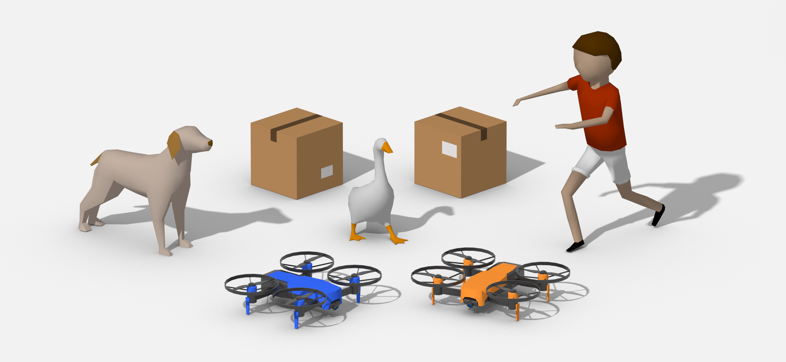

# Verifiably Safe Reinforcement Learning Examples
This repo contains a series of examples and environment to test and challenge reinforcement learning algorithms 
in safe environments. The [Verifiably Safe Reinforcement Learning framework](https://github.com/IBM/vsrl-framework) 
is used as reference but the environments can be tested with any RL algorithm.

### What is Verifiably Safe Reinforcement Learning?
Verifiably Safe Reinforcement Learning (VSRL) is a new neuro-symbolic method that guarantees that safety specifications 
(e.g. collision avoidance) are maintained both during training and testing of reinforcement learning agents 
by means of formal, computer-checked proofs. The VSRL system is built to guarantee safety by means of 
a symbolic description of safety constraints, such as maintaining a safe distance between the agent and obstacles. 
This is then enforced on top of classical reinforcement learning mechanisms e.g. PPO, TRPO, etc. 
In this repository, you will be able to test and benchmark VSRL in an environment that can be customized 
to challenge reinforcement learning algorithms to operate in a safe mode.

### A benchmark for Safe Reinforcement Learning
The environments associated with this repo are meant to extend other safe environments like safe-gym 
by providing an interface with Unity using the [gym-unity](https://github.com/Unity-Technologies/ml-agents/tree/0.15.1/gym-unity) 
wrapper. 

### Requirements
- [Python 3.6 or 3.7](https://www.python.org/downloads/)
- [Pre-compiled binaries](https://github.com/IBM/vsrl-examples/releases/tag/untagged-f67218e83e56ab6c64e4) - Please read instructions [here](https://github.com/IBM/vsrl-examples/tree/master/examples/EnvBuild)
- (optional, only to create new environments) [Unity Hub](https://store.unity.com/download)

### Setup
Clone the repository and open the project folder.
```sh
git clone git@github.ibm.com:etx-vsrl/vsrl-os-examples.git
cd vsrl-os-examples
```

To facilitate the installation process, a script is provided to install/update dependencies:
```sh
./setup.sh
```

This process will create an environment with all the necessary dependencies. To activate the environment run:
```
source venv/bin/activate 
```

## Getting started
Examples can be found in [`examples`](./examples). [`examples/README.md`](./examples/README.md) provides an overview 
of the different examples in this repo. 

## Do you want to contribute?

If you would like to contribute, please review our [code of conduct](./CODE_OF_CONDUCT.md) and 
[contributing](./CONTRIBUTING.md) document.

## License

		MIT License

		Copyright (c) 2020 International Business Machines

		Permission is hereby granted, free of charge, to any person obtaining a copy
		of this software and associated documentation files (the "Software"), to deal
		in the Software without restriction, including without limitation the rights
		to use, copy, modify, merge, publish, distribute, sublicense, and/or sell
		copies of the Software, and to permit persons to whom the Software is
		furnished to do so, subject to the following conditions:

		The above copyright notice and this permission notice shall be included in all
		copies or substantial portions of the Software.

		THE SOFTWARE IS PROVIDED "AS IS", WITHOUT WARRANTY OF ANY KIND, EXPRESS OR IMPLIED,
		INCLUDING BUT NOT LIMITED TO THE WARRANTIES OF MERCHANTABILITY, FITNESS FOR A
		PARTICULAR PURPOSE AND NONINFRINGEMENT. IN NO EVENT SHALL THE AUTHORS OR COPYRIGHT
		HOLDERS BE LIABLE FOR ANY CLAIM, DAMAGES OR OTHER LIABILITY, WHETHER IN AN ACTION
		OF CONTRACT, TORT OR OTHERWISE, ARISING FROM, OUT OF OR IN CONNECTION WITH THE
		SOFTWARE OR THE USE OR OTHER DEALINGS IN THE SOFTWARE.
