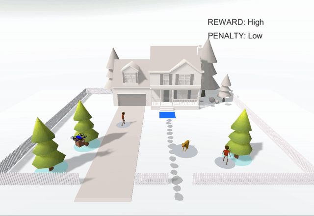

# The DroneDelivery Environment

## About the environment
The drone is the agent in the environment. Its goal is to reach the target area, the blue square in front of the house.
At the beginning of each episode, the drone's starting position is assigned a random position in the yard. 

The drone may encounter trees, dogs, geese, or children on its way to the target.
The trees are static obstacles, while the dogs, geese, and children are animated obstacles. These obstacles can move in a circular 
manner, pace back and forth (which we will refer to as linear), or chase the drone. All animated obstacles can be 
assigned a position to start from, and all trees can be customized to be at a certain position in the yard. There 
are always three static and three animated obstacles in the environment. Of the three animated obstacles, the number 
of dogs, geese, and children, as well as their movements, are configurable. 

### Observations
There are 23 observations being collected by the agent, which are listed below:
- distance between the agent and target
- x-value of the agent's position
- z-value of the agent's position
- x-value of the agent's velocity
- z-value of the agent's velocity
- For each of the three animated obstacles:
    - distance between the agent and the animated obstacle
    - x-value of the animated obstacle's position
    - z-value of the animated obstacle's position
- For each of the three static obstacles:
    - distance between the agent and the static obstacle
    - x-value of the static obstacle's position
    - z-value of the static obstacle's position

### Reward structure
The Unity environment uses the following reward structure:

| Scenario | Reward/penalty value | Does the episode end? |
| --- | --- | --- |
| Agent falls off the platform | -400 | Yes |
| Agent reaches target | 1 (configuration=low), 10 (medium), 100 (high) | Yes |
| Maximum number of steps (=1000) reached | None |  Yes |
| Agent collides with static obstacle | -0.1 | Configurable (default is no) |
| Agent collides with animated obstacle | -0.1 (configuration=low), -0.5 (medium), -1 (high) | Configurable (default is no) |
| Agent's distance to the goal | -0.01 * distance to the target | No |

## Environment configurations
The current designs for the Unity environments allow the following configurations 
via the [`env_config.json`](./env_config.json) file:
- `type`: Type of animated object (dog, child, goose)  
Should be a list of three strings, each string being "child", "dog", or "goose". If there are fewer than three specified types, 
the remaining animated obstacles will be dogs. If no value is specified in the config file, the animated objects will be 
dogs. If no config file is found, there will be one child and two dogs.

- `movement`: Type of animated object behavior (circular, linear, chase)  
Should be a list of three strings, with each string being "circular", "linear", or "chase". If no value is specified
in the config file, the animated obstacles will have circular movement. If no config file is found, 
the animated obstacles will be assigned either circular or linear movement.

- `animatedPositions`, `treePositions`: Starting position of dogs and trees  
Should be a list of three positions, in which each position is represented as: 
`{ "x": "-.--", "y": "-.--", "z": "-.--" }`.  If there are fewer than three positions, random positions 
will be assigned to obstacles without a specified position. If no value is specified or a config file is not found, 
all obstacles will be assigned random positions at the beginning of each episode.
To be visible and inside the fence, x should be between -0.7 and 1.1, y should be greater than or equal to 0.46,
and z should be between -1.3 and -0.1.

- `reward`: Reward (low, medium, high)  
If no value is specified in the config file, the default value is "high".
If no config file is found, the default value is "low". 

- `penalty`: Penalty (low, medium, high)  
If no value is specified in the config file, the default value is "high".
If no config file is found, the default value is "low". 

- `endAtCollision`: End the episode when the drone collides with some animated or static obstacle (false, true)  
If no value is specified or a config file is not found, the default value is false, so the episode
will not end at collision with an obstacle.

All environment variable values should be strings.
